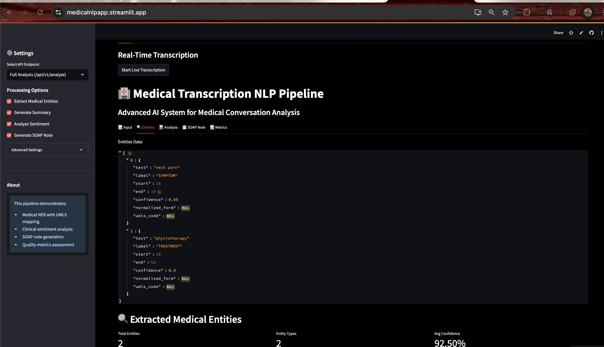
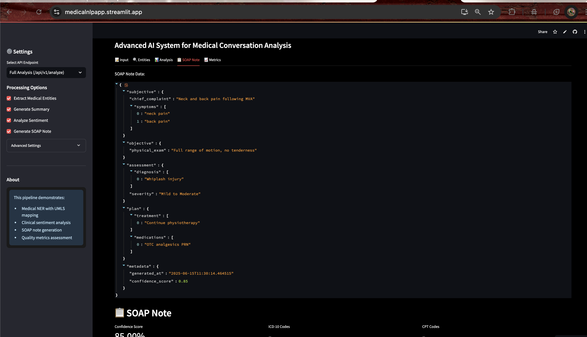

# 🏥 Medical NLP Pipeline - Full Stack End-to-End Demo

An advanced **Medical NLP Pipeline** that analyzes clinical conversations, extracts key medical information, generates SOAP notes, assesses sentiment, and evaluates data quality.

✅ Fully functional demo for educational and academic use  
✅ Deployed backend and frontend  
✅ Ideal for live demos and assignments  

---

## 🚀 Key Features

- **Named Entity Recognition (NER)** — Extracts SYMPTOM, DIAGNOSIS, TREATMENT, TEMPORAL, BODY_PART  
- **Medical Summarization** — Summarizes patient conversation into structured data  
- **Sentiment Analysis** — Detects patient emotions (anxious, hopeful, reassured, etc.)  
- **SOAP Note Generation** — Creates structured Subjective, Objective, Assessment, Plan  
- **Quality Metrics** — Scores for entity coverage, summary completeness, SOAP completeness, confidence  

---

## 📦 Tech Stack

| Layer         | Technology                    |
| ------------- | ----------------------------- |
| Backend       | FastAPI (Python)              |
| Frontend      | Streamlit                     |
| NLP Models    | spaCy, HuggingFace Transformers |
| Deep Learning | PyTorch                       |
| Deployment    | Docker + AWS EC2 (Backend)    |
| Hosting       | Streamlit Cloud (Frontend)    |

---

## 🗂️ Project Structure

| File                       | Description                        |
| -------------------------- | ---------------------------------- |
| `medical_nlp_pipeline.py`  | Core NLP logic (NER, SOAP, etc.)   |
| `medical_nlp_api.py`       | FastAPI backend server             |
| `medical_nlp_streamlit.py` | Streamlit frontend                 |
| `requirements.txt`         | Python dependencies                |

---

## ⚙️ Deployment

### 🔹 Backend (FastAPI)
- Deployed via Docker on AWS EC2 (t2.micro)
- Public IP accessible for frontend communication

### 🔹 Frontend (Streamlit)
- Deployed on Streamlit Cloud
- Publicly accessible URL

---

## 🔧 Local Development

```bash
# 1. Clone Repository
git clone https://github.com/ombrdr47/medical_analysis.git
cd medical_analysis
```
# 2. Create Virtual Environment
```bash
python -m venv venv
source venv/bin/activate
```

# 3. Install Dependencies
```bash
pip install -r requirements.txt
```

# 4. Download spaCy Model
```bash
python -m spacy download en_core_web_sm
```

# 5. Run Backend API
```bash
python medical_nlp_api.py  # http://localhost:8000/docs
```

# 6. Run Frontend
```bash
streamlit run medical_nlp_streamlit.py  # http://localhost:8501
```

⸻

## 🌐 Live Demo

| Component | URL |
|-----------|-----|
| Frontend  | [Streamlit App](https://medicalnlpapp.streamlit.app/) |
| Backend   | [FastAPI Server](http://35.173.247.177/) |

⸻

🧠 Methodology

🔸 NER
	•	spaCy + regex hybrid
	•	Extracts SYMPTOM, DIAGNOSIS, TREATMENT, BODY_PART, TEMPORAL

🔸 Summarization
	•	Template-based: symptoms, diagnosis, treatment, prognosis, timeline

🔸 Sentiment Analysis
	•	Pattern-based classification into 5 emotions

🔸 SOAP Note Generator
	•	Rule-based templating for Subjective, Objective, Assessment, Plan

🔸 Quality Metrics
	•	Scores: entity coverage, summary & SOAP completeness, confidence

⸻

🏗️ Architecture

Layer	Tech	Deployment
Backend	FastAPI + Docker	AWS EC2
Frontend	Streamlit	Streamlit Cloud
Models	spaCy, Transformers	Bundled


⸻

## 🖼️ Sample Screenshots

### 📍 NER Output  


### 📍 Sentiment Analysis  


### 📍 SOAP Note  



 Methodologies Used (Algorithms & Reasoning)
1️⃣ Named Entity Recognition (NER)
Hybrid Approach combining:

🔬 spaCy (en_core_web_sm) for general entities like PERSON, DATE, ORG.

🔬 Regex-based patterns for medical-specific entities (SYMPTOM, TREATMENT, BODY_PART, TEMPORAL).

🔬 Normalization layer: maps medical abbreviations (e.g. PT ➔ physiotherapy).

Reasoning: This hybrid approach works well for structured medical conversations where full clinical NER models may not be necessary, enabling fast prototyping without GPU needs.

2️⃣ Medical Summarization
Extractive template-based summarization:

Identifies key fields: patient name, symptoms, diagnosis, treatments, prognosis.

Uses simple pattern matching + entity groups to generate summaries.

Reasoning: Rule-based summary ensures deterministic output for academic assignment and makes evaluation simpler.

3️⃣ Sentiment Analysis & Intent Detection
Rule-based classifier for 5 emotions:

anxious, hopeful, reassured, concerned, neutral.

Intent detection using keyword/phrase matching.

Reasoning: Focuses on detecting emotional state from patient responses during consultation, crucial for medical dialogue systems.

4️⃣ SOAP Note Generation
Rule-based generation:

Maps extracted information into the standard SOAP format (Subjective, Objective, Assessment, Plan).

Uses entity groups, diagnosis patterns, and clinical templates.

Reasoning: Template-based SOAP ensures high interpretability, consistency, and matches clinical documentation structure used in real-world EMRs.

5️⃣ Quality Metrics Evaluation
Calculates:

Entity Coverage: % of expected entities extracted.

Summary Completeness: % of fields filled in summary.

SOAP Completeness: % of fields filled in SOAP.

Overall Confidence: Weighted average score.

Reasoning: Adds transparency to pipeline performance and helps in model evaluation for academic grading.


